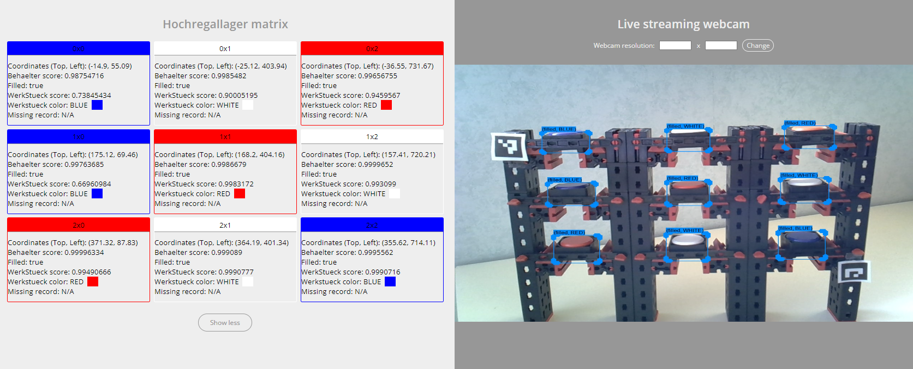

<h1 align="center">Object Detection on a Fischertechnik smart factory - high bay rack</h1>

This app was made to monitor a Fischertechnik high bay rack. An SSD MobNet (pre-trained model from TensorFlow model zoo)
object detection model was trained to detect workpieces and containers. Different computer vision techniques are used to 
extract relevant information. Some of the relevant information is:

- position of the containers in the high bay rack
- whether containers are filled with workpieces or empty
- color of workpieces
- how long a container was removed

Relevant information is displayed using a web UI, created using Flask.

## Links

- [TensorFlow model zoo](https://github.com/tensorflow/models/blob/master/research/object_detection/g3doc/tf2_detection_zoo.md)

## Screenshots

## Built With

- Python
- JavaScript
- HTML
- CSS

## Installation

To run this project you need to set up TensorFlow and install the used packages within the requirements file.

